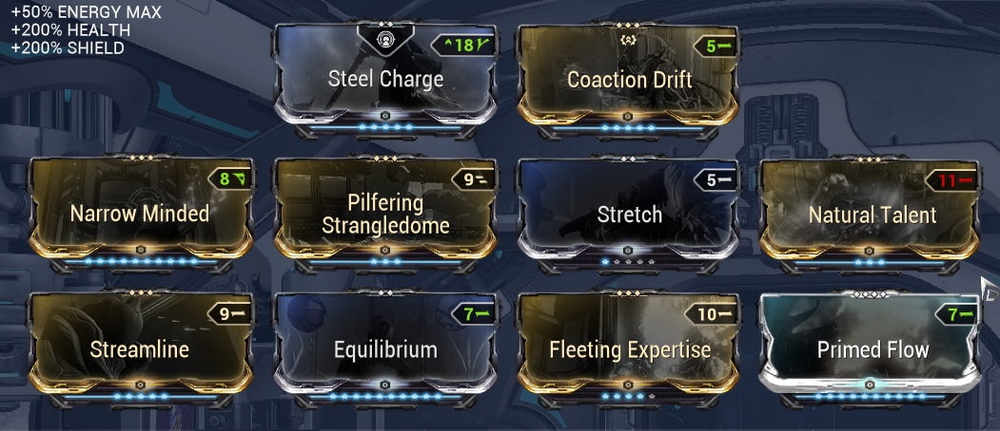
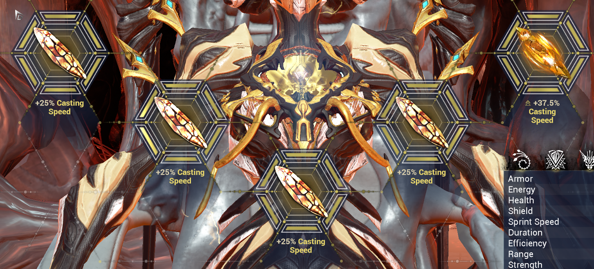
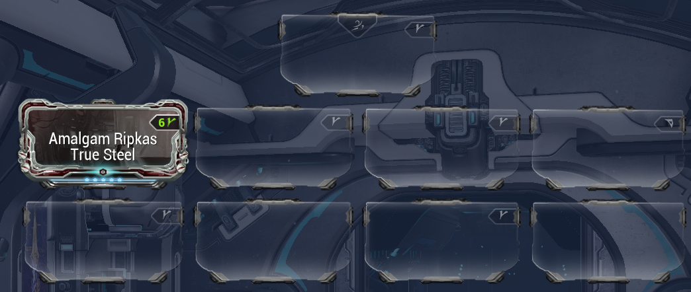
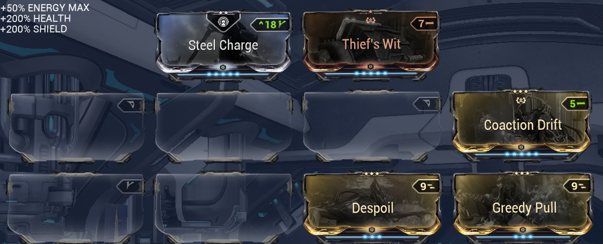
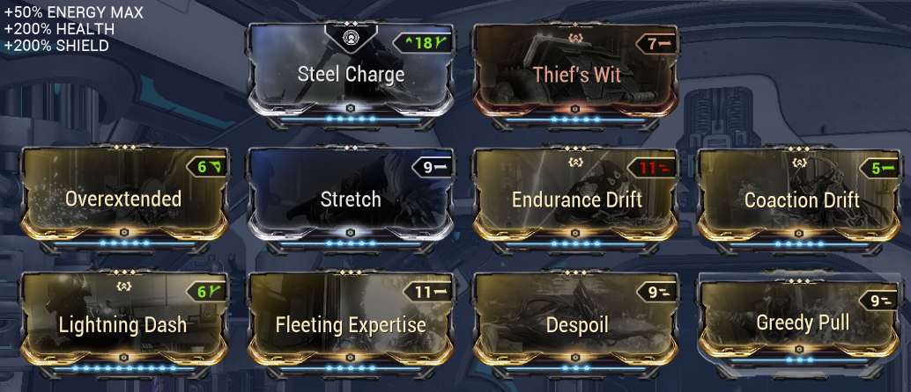
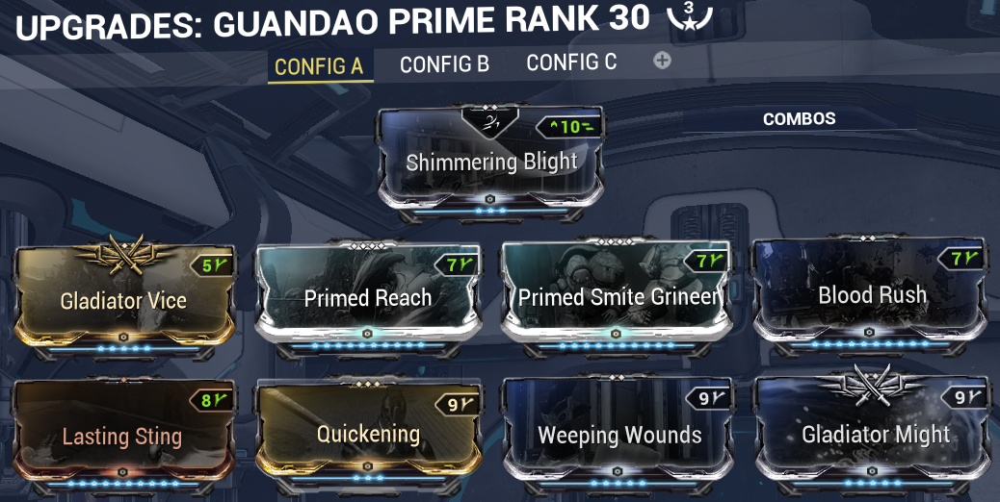
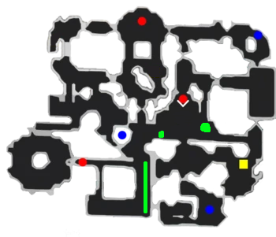

# Endo Ripkas Expedite Suffering (RES) Strat

This document extends [The The Ultimate Endo Farm Guide](https://docs.google.com/document/d/13y8HIYBsi1WiY0JfO6mSLHENbd34LKn3iz9RwsVikw0/), and will mention what change is needed for this ripkas strat.  

[Why run this strat?](#why-run-this-strat)  
[]

Roles:
- [Nidus](#nidus)
- [Vazarin Nekros](#vazarin-nekros)
- [DPS Nekros](#dps-nekros)
- [Khora](#khora)
___
## Nidus
No change for nidus [build](https://docs.google.com/document/d/13y8HIYBsi1WiY0JfO6mSLHENbd34LKn3iz9RwsVikw0/edit#heading=h.nhvovr9x1lsl) and [run procedure](https://docs.google.com/document/d/13y8HIYBsi1WiY0JfO6mSLHENbd34LKn3iz9RwsVikw0/edit#heading=h.l30u2xvft94o)  
btw don't cap fps as host https://youtu.be/zCHg4Gbqn-s
___
## Khora
__Requirements:__
- Have [Ripkas](https://warframe.fandom.com/wiki/Ripkas) with [Amalgam Ripkas True Steel](https://warframe.fandom.com/wiki/Amalgam_Ripkas_True_Steel)
- Have unlocked [Expedite Suffering](https://warframe.fandom.com/wiki/Expedite_Suffering) (rank 9 helminth)
- Have [Amber Archon Shards](https://warframe.fandom.com/wiki/Archon_Shard) (yellow) for casting speed
- Have [Zenurik](https://warframe.fandom.com/wiki/Focus/Zenurik) Wellspring and Inner Might.

__Builds:__  
_Frame_  
  
_Shards_  
  
_Ripkas_  
  

__Run procedure:__  
Get health orb -> set venari to heal (and select heal target) -> cast cage at corner -> Zenurik Wellspring for your nekros teammates -> spam Expedite Suffering -> recast cage when it is about to run out

__Demo:__  
  
___
## Vazarin Nekros

__Requirements:__
- Magus Cloud R5
- Vazarin Protective Sling R3

Basically [old Khora](https://docs.google.com/document/d/13y8HIYBsi1WiY0JfO6mSLHENbd34LKn3iz9RwsVikw0/edit#heading=h.k60v6asjn9pz) but only the vazarin dashing part (step 3 and 8).  
Cast Desecrate (3rd ability) -> dash teammates to maintain invulnerability -> pull endo

Attacking is optional, your primary job is to protect the team.

**Build**

Put whatever you like in the empty slots, my suggestion:

If you decide you want to attack between dashes refer to dps nekros build
___
## DPS Nekros
__Requirement:__
- Have mentioned builds

Same [run procedure](https://docs.google.com/document/d/13y8HIYBsi1WiY0JfO6mSLHENbd34LKn3iz9RwsVikw0/edit#heading=h.on36r8gaz4gy), and [frame build](https://docs.google.com/document/d/13y8HIYBsi1WiY0JfO6mSLHENbd34LKn3iz9RwsVikw0/edit#heading=h.36qoxndrz31x) just changing the weapon build

**Weapon Build**

___
## Small note on spawn manipulation
<ins>___Where you look enemies will not spawn.___</ins>  
You want to encourage spawns in the green areas:  

___
## Why run this strat?
__The core idea here is:__  
When paired with Ripkas Alamgam, Expedite Suffering guarantees to split the killed enemy into desecrate-able parts.  
This *should* yield more endo more consistently but will require more info gathering.  
